
# 3500 PA05 Project Repo
## Features
### Week View
Days are displayed horizontally, with the journal's name at the top. Inside each day's block, tasks and events are listed vertically. The program includes a task queue, a weekly overview, and a notes section. All user interactions occur via the menu bar at the top. This is a functional, easy-to-use personal organizer.

  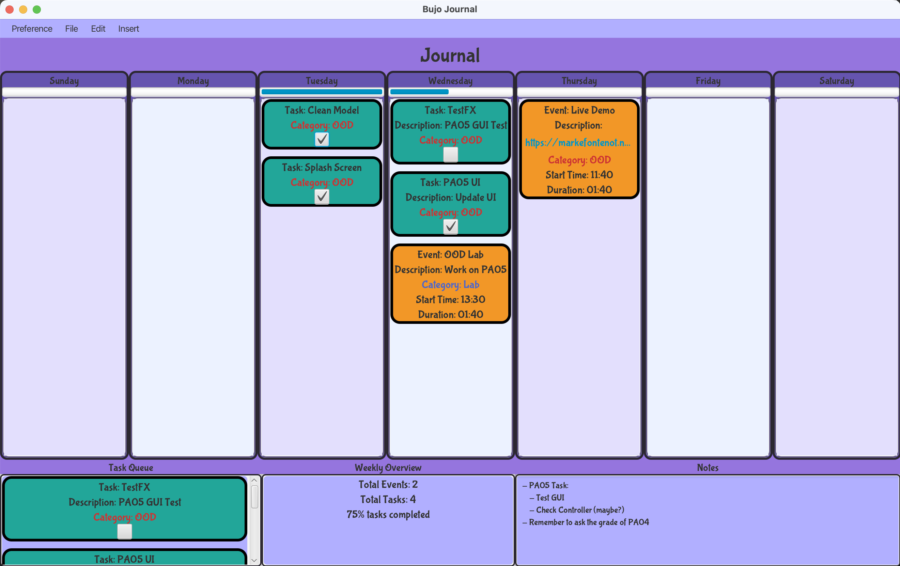

### Event and Task Creation
Users should have the capability to generate a new Event or Task and select a specific day of the week for its display. For every Event, users must define the following parameters: name, description (optional), day of the week, start time, duration, and category (optional) - with all but the description being mandatory. For each Task, the user needs to provide: a name, description (optional), day of the week, and category (optional). By default, new Tasks are tagged as incomplete.

  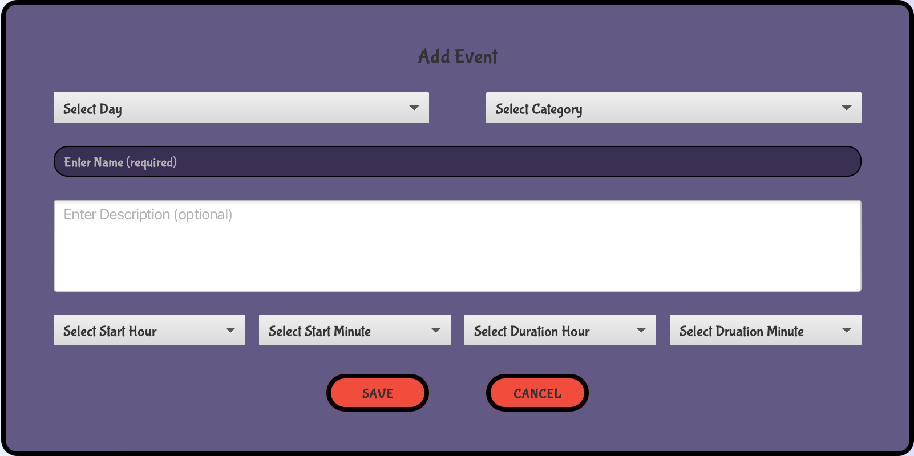
  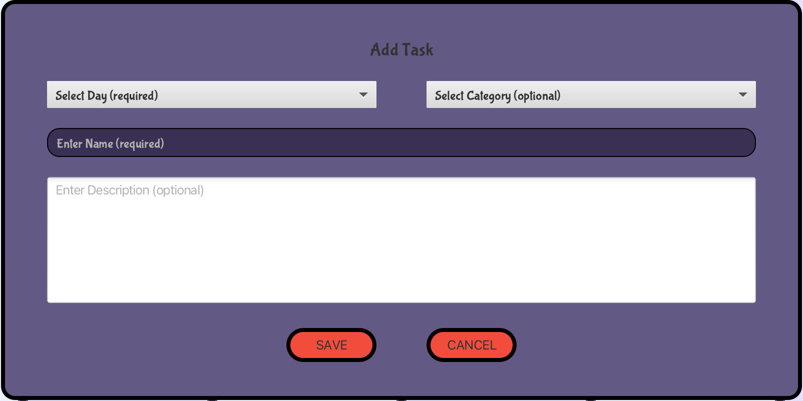

### Persistence
Users have the ability to save their journal locally in their chosen directory, and likewise, load a journal when needed. The journal will be stored in JSON format, but with a unique extension ".bujo" for easy identification and access.

### Commitment Warnings
Users are given the capability to set a limit for the number of events and tasks per day. This restriction applies uniformly to every day of the week. If a user exceeds these set limits, a prompt warning message will be displayed. Importantly, these maximum values for tasks and events within a week will be retained and saved within the corresponding '.bujo' file.

  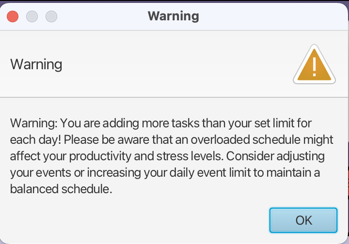

### Task Queue
The program includes a Task Queue feature that automatically accumulates all tasks from the week. This design streamlines task management, providing an easier way for users to review their tasks at a glance.

  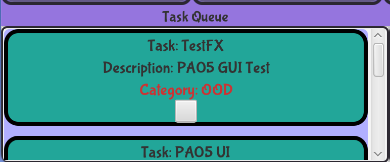

### Categories
Every event or task within the program can be categorized for easier management. Users can create new categories, which are applicable for the entire week and are saved as part of the '.bujo' file format. This enables users to assign a specific category to an event or a task, further streamlining their organization process.

  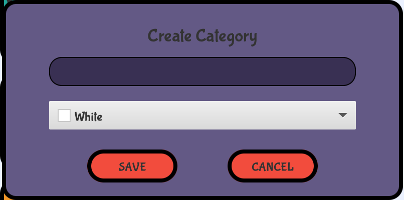

### Quotes & Notes
The program includes a note-writing feature where users can jot down their thoughts. Notes can be edited by opening a dedicated box and any changes made will be immediately reflected in the view. This provides users with an easy and intuitive way to manage their notes.

  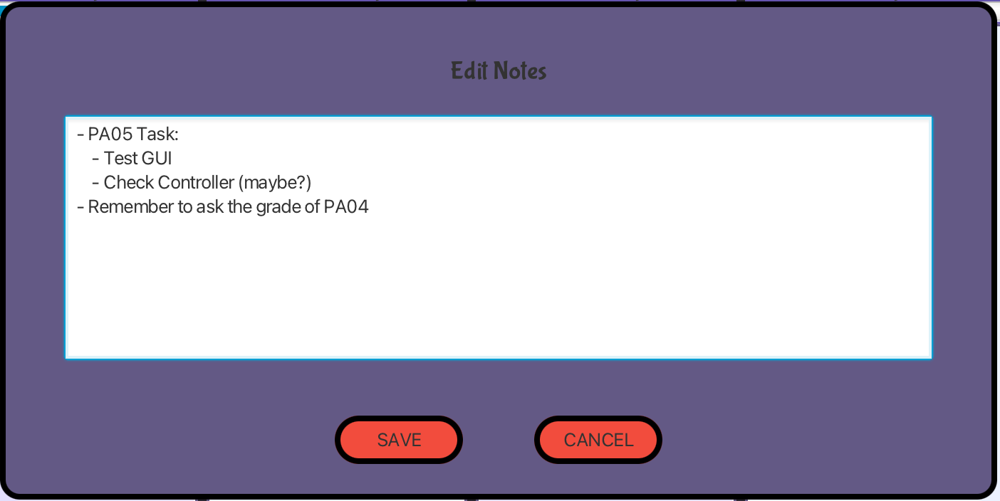
  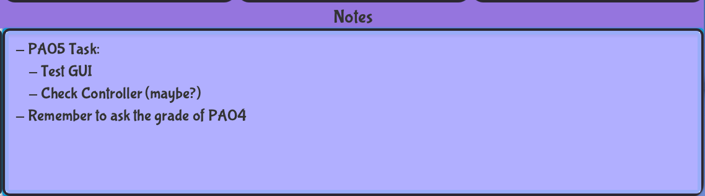

### Weekly Overview
The program's graphical user interface includes a weekly statistics section. This presents key metrics such as the total number of events and tasks, along with the percentage of tasks that have been completed. This data-driven insight aids users in tracking their productivity throughout the week.

  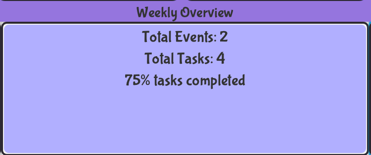

### Progress Bar
The program features a daily progress bar, graphically illustrating the number of tasks completed versus those planned for each day. In addition, a numerical count of the remaining tasks for each day is also provided. Both these elements are displayed prominently on the Week view, offering users a clear visual of their daily task progress.

  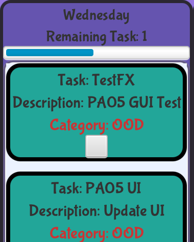

### Auto #tags
Users can seamlessly categorize a Task/Event by simply prepending the category name with a '#' in the title. The system automatically assigns the category to the Task/Event and removes the '#' along with the category name from the title. If the category does not yet exist, the program has two options: it can create the new category and assign the Task/Event to it, or alternatively, it can retain the '#text' as part of the title as it is.

  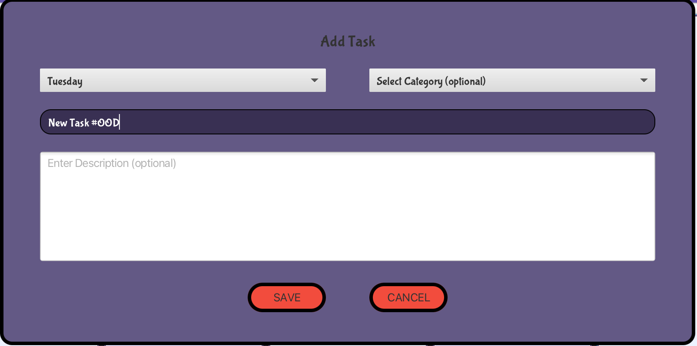
  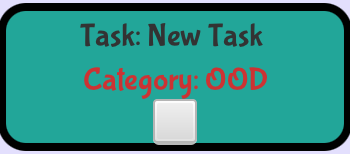

### Links
Our program has the capacity to parse any valid HTTP/HTTPS link included in a description, making it clickable directly from the detailed view of your Event/Task. This feature enhances user experience by providing direct and easy access to relevant online resources.

  

### Visual Flourish
The UI changes, in general, were done by using scene builder, directly editing FXML files, writing some CSS files, and programmatically in Java. We made an attempt to do it all in scene builder, but we were struggling to get a look we like while only relying on this method. We took a little time to learn some CSS so we could make stylesheets for custom buttons. These buttons are highlighted when you hover over them, and change color when clicked on. We also made custom text fields, text areas, dropdown menus, and toolbar, and changed background colors.  The font (Bubblegum Sans) was downloaded from Google Fonts, and we chose it because we wanted our journal to have a fun, colorful, and creative feel.

### Splash Screen
Upon every journal opening, users are greeted with a welcoming screen. This feature provides a friendly start to the user's interaction with the program, setting a positive tone for their journaling experience.

  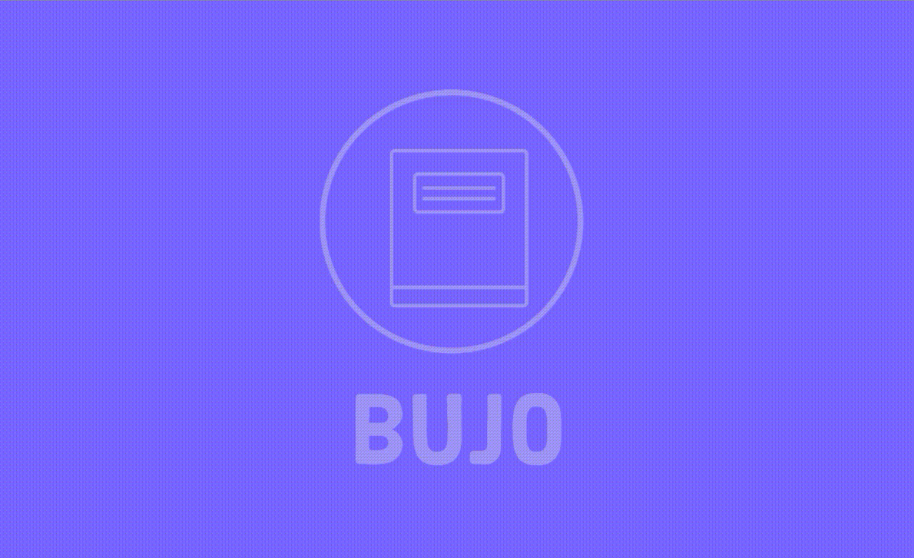

### Privacy Lock
We've incorporated security features to safeguard your bullet journal. When creating a journal, users are required to set a password. This password, encrypted using secure hashing algorithms, adds an extra layer of protection to your journal content. Subsequent access to the journal mandates the input of the correct password, ensuring that your notes, tasks, and events remain secure and private.

  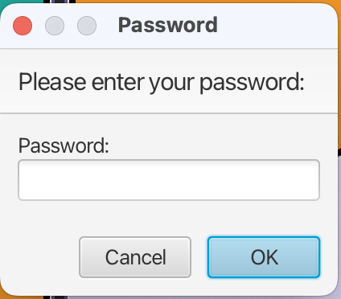
  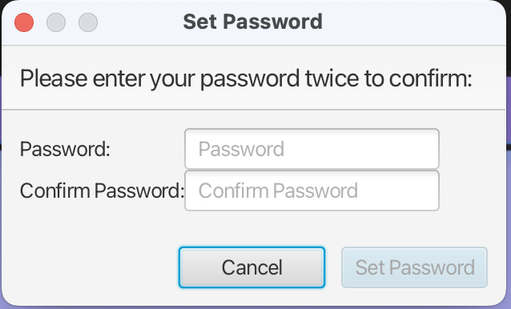

### Weekly Starters
Our program offers the flexibility to open a '.bujo' file as a template. Upon doing so, users will be prompted to name the new week, superseding any pre-existing name in the template. While previous Events and Tasks are not transferred, all other preferences such as commitment warnings and categories will be carried forward to the new week. Importantly, this new week is saved as a separate '.bujo' file, ensuring that the original template file remains unaltered. This allows users to reuse templates without the worry of overwriting them.

## SOLID Principles
### Single Responsibility Principle (SRP)
The ApplicationController is a good example of the SRP. It handles user interaction logic but leaves the specifics of data persistence to BujoUtils, the specifics of file selection to FileSelector, and so forth. This makes it easier to understand and modify the ApplicationController, since it doesn't handle unrelated responsibilities.

### Open-Closed Principle (OCP)
This principle is observed in how you've implemented the EventHandler<ActionEvent> interface in your LoadTemplateHandler class. By implementing this interface, you've opened your handler to extension (you can create any number of these for different purposes), but closed it to modification (you won't have to change the code that triggers the events or the event handling framework itself).

### Liskov Substitution Principle (LSP)
An example can be seen in the usage of the EventHandler<ActionEvent> interface in the LoadTemplateHandler class. Any class implementing this interface can be used interchangeably without causing issues or changing the correctness of the program. This ensures that subclasses or implementing classes are substitutable for their base classes or interfaces.

### Interface Segregation Principle (ISP)
You're not showing any complex interfaces in your code, but this principle is about making sure that classes don't have to depend on methods they do not use. For instance, if there were an interface that both LoadTemplateHandler and FileSelector implement, but which includes methods that don't apply to both classes, it would make sense to split this interface into two smaller, more specific interfaces.

### Dependency Inversion Principle (DIP)
The LoadTemplateHandler class provides an example. Its handle() method depends on the ApplicationController through a high-level abstraction, rather than on concrete details. This allows you to change how you implement ApplicationController without needing to modify LoadTemplateHandler. This principle helps to decrease the coupling between classes.

## Implementing Future Features
### Menu Bar and Shortcuts
We have already implemented a menu bar because we thought it would be a clearer-looking way to design our UI, but we haven't implemented shortcuts. To do this, we would likely create a create new KeyCodeCombinations in new event handlers, and have a conditional in the handle(Event) method that checks if the inputted event is the right keycode combination. If it is the right Key combination then it delegates to the handle method of the previously built EventHandler's handle method for the functionality. For example, if you wanted to do ctrl + e to create a new event, the Event handler would delegate to the AddEventHandler's handle method, which would launch the popup window.

Another extension of our functionality could come in the form of user-set themes. To do this, all the colors would be set based on an enum that stores hex codes for different element colors. Our application controller would have a field for this enum, and a method that allows the user to change the value of the field. This would allow us to change the color scheme of the entire platform with one function call. Then all you would need to do is to design this menu and implement relevant event handlers.
